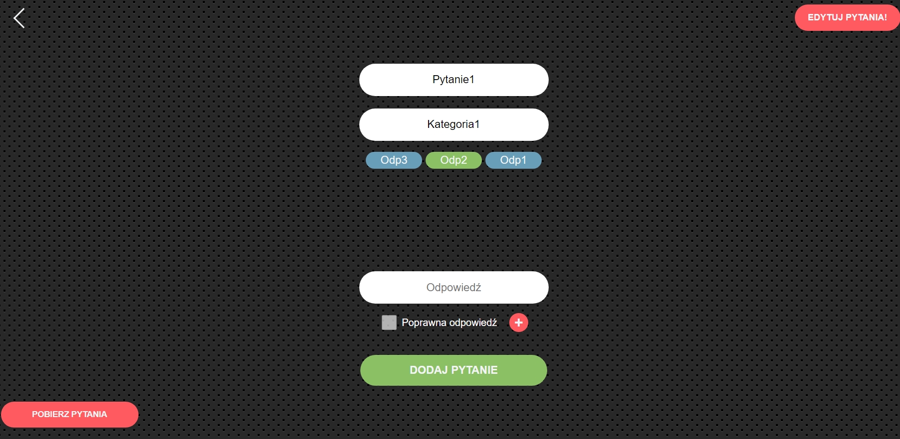
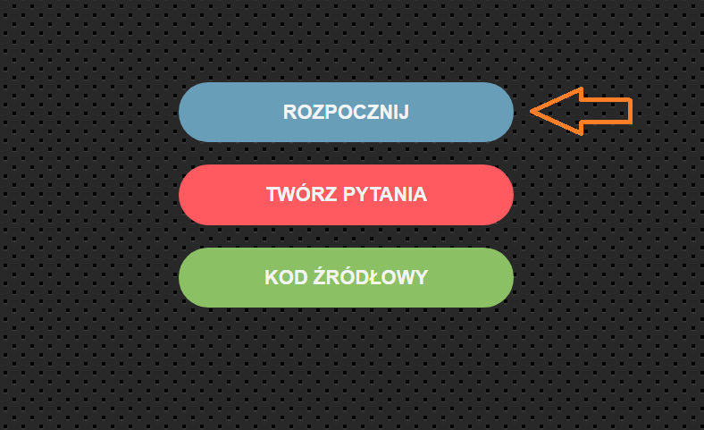
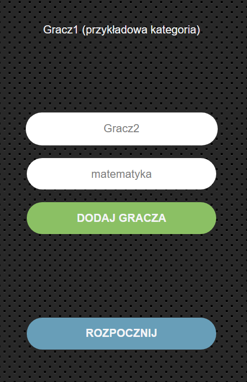
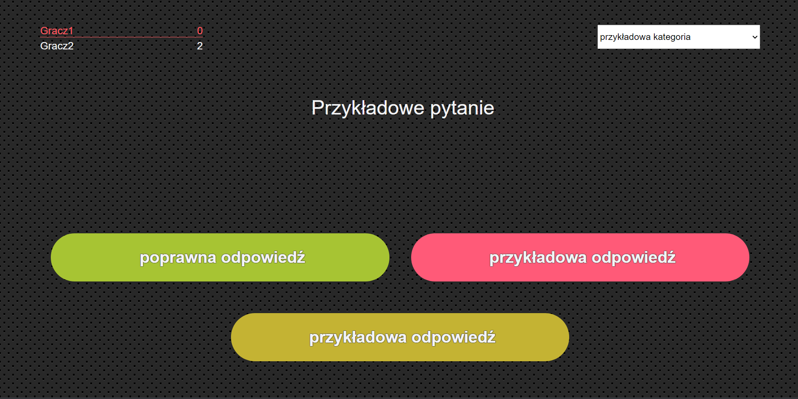
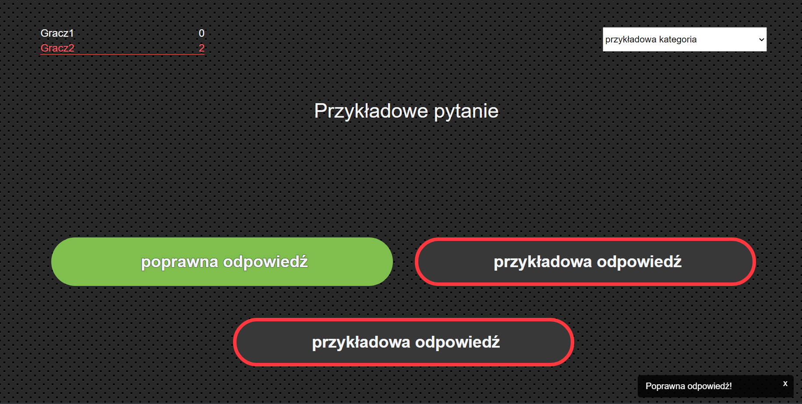
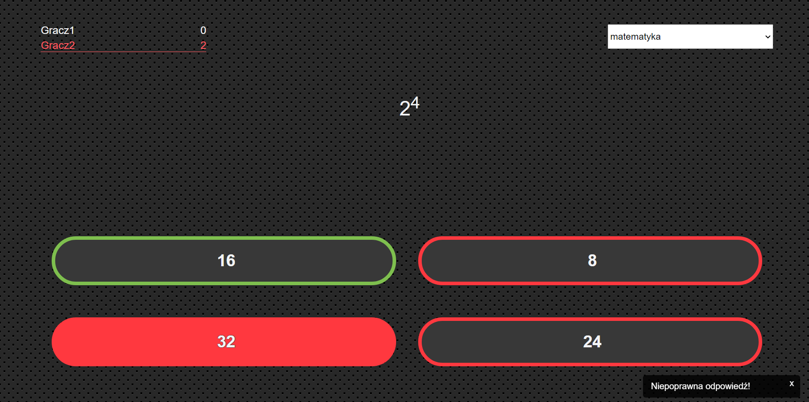

# Quiz
## this app was made for school purposes - making & displaying quizes

### Setup
- include the javascript files in the script tag (in the exact same order) of your html file and you're good to go!

### Usage
- Adding questions is fairly simple - just enter the content of the question, add its category and add answers. Remember to add a correct one (you will be notified if anything is wrong). Once you finished creating question - confirm it by adding it to the question pool.

- When you're done with creating questions just simply download them by clicking the button red button in bottom left corner - the file with your questions should start downloading.
- If you want to start the game, press the blue button on the main screen and select file with questions you just created.

- After selecting question file, you need to add players - each player has a name and a category. When a player answers a question in his own category, he gets less points than if he'd answer a question from a different one.

- Remeber to press the green button to confirm adding a player (if everything is good, the player name with his/hers category should apear above the form (like in the picture above))
- Press the blue button after you add all the players and start the game.
- The UI is very simple - current player is highlighted in the top left corner (on scoreboard) - he has to choose the correct answer. If a player wants to choose different question category, he has to use the drop-down menu in the top-right of the screen.
- Here is how it looks
- 

